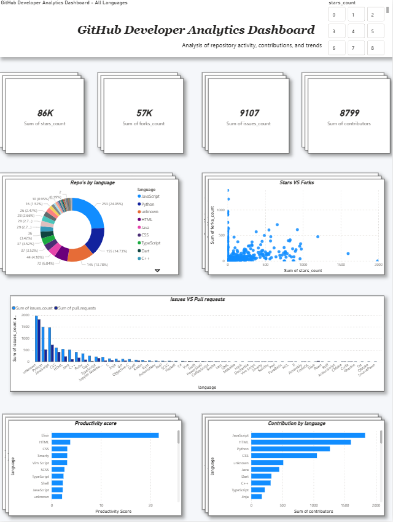
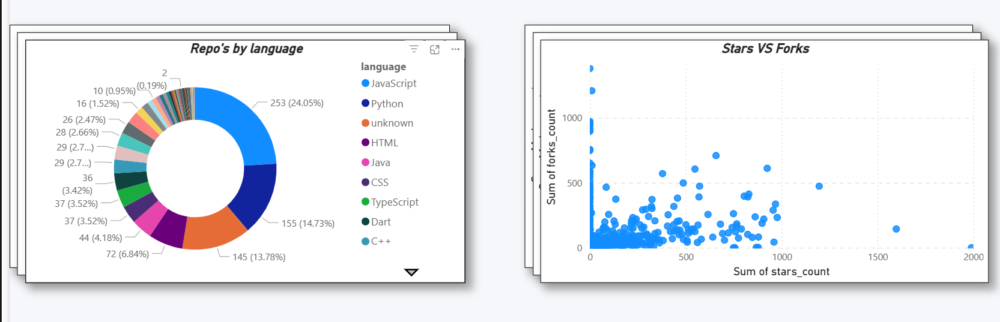
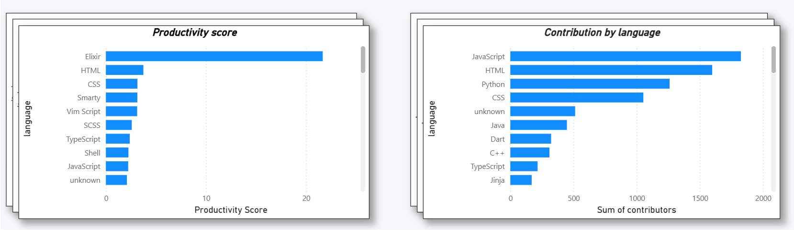
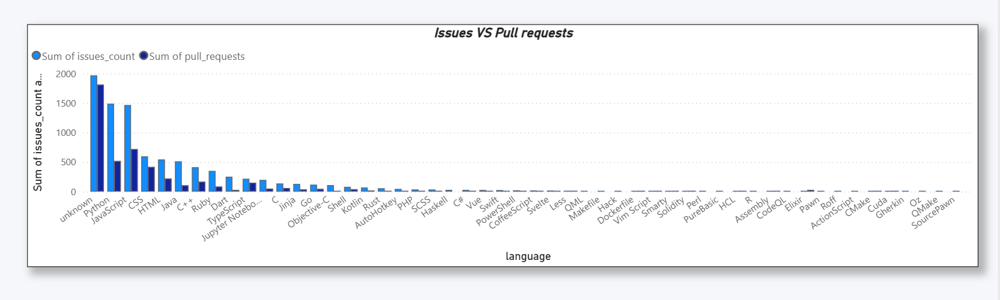

# 📊 GitHub Developer Analytics Dashboard

## 🚀 Overview
This project is an interactive **GitHub Developer Analytics Dashboard** built using Power BI. It analyzes repository performance, developer contributions, and project health to provide meaningful insights into open-source activity.

The dashboard is designed with a **multi-page, app-like interface** including navigation, tooltips, and dynamic filtering, making it similar to real-world industry dashboards.

---

## 🎯 Objectives
- Analyze repository popularity using stars and forks  
- Track development activity using issues and pull requests  
- Identify high-performing and under-maintained repositories  
- Provide interactive insights for better decision-making  

---

## 📊 Features

### 🔹 Overview Page
- KPI Cards (Stars, Forks, Issues, Contributions)  
- Language Distribution (Donut Chart)  
- Stars vs Forks (Scatter Plot)  

### 🔹 Analysis Page
- Issues vs Pull Requests  
- Productivity Score (custom metric using DAX)  
- Contributions by Language  

### 🔹 Details Page
- Top Repositories (dynamic ranking)  
- Repository Health Status (Healthy vs Needs Attention)  

---

## 🧠 Advanced Features

- ✅ Multi-page navigation (app-like experience)  
- ✅ Tooltip page (hover-based detailed insights)  
- ✅ Drill-down functionality (Language → Repository)  
- ✅ Dynamic title (changes based on filters)  
- ✅ Smart insight card (auto-detects issues in repos)  
- ✅ Custom DAX measures (Productivity Score, Ranking)  
- ✅ Interactive slicers (filters across all pages)  

---

## 🛠️ Tools & Technologies
- Power BI Desktop  
- DAX (Data Analysis Expressions)  
- Data Cleaning using Power Query  

---

## 📸 Screenshots

### Overview

### Chart Analysis

### Graph

---

## 🔍 Key Insights

- High-star repositories tend to have higher fork counts  
- Some repositories show high issues but low pull requests → indicating low maintenance  
- Popular languages dominate contribution activity  
- Productivity score helps identify efficient repositories  

---

## 📌 How to Use

1. Download the `.pbix` file  
2. Open in Power BI Desktop  
3. Interact using filters and navigation buttons  
4. Explore insights across multiple pages  

---

## 💡 Future Improvements

- Integration with GitHub API for real-time data  
- Adding predictive analytics (ML models)  
- Enhanced UI/UX with custom themes  

---

## 🤝 Contributing

Feel free to fork this repository and improve the dashboard or add new features.

---

## 📬 Contact

If you have any feedback or suggestions, feel free to connect!

---

⭐ If you like this project, consider giving it a star!

